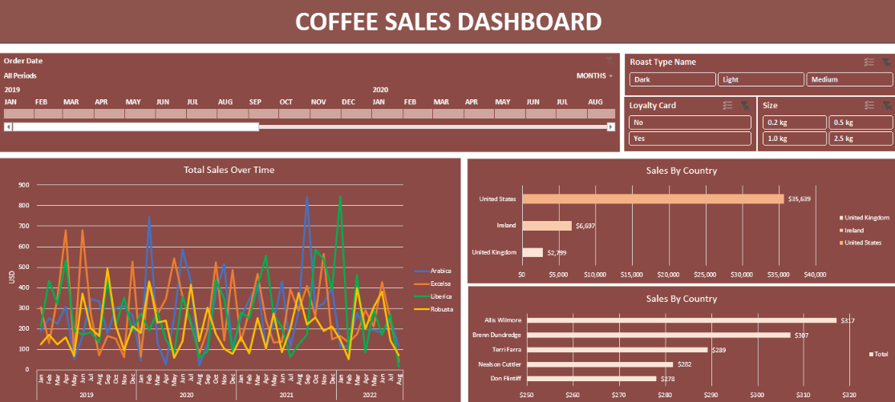

# ☕ Coffee Sales Dashboard

An interactive Excel dashboard analyzing coffee sales, customer behavior, product performance, and sales trends using cleaned transactional data.

## 🎯 Objective

Analyze coffee sales data to understand:

- Sales trends over time
- Sales performance by country
- Customer purchasing patterns
- Product and roast-type performance
- Impact of loyalty cards and package sizes

## 🛠️ Tools Used

Microsoft Excel

## 🔄 Workflow

Raw Data → Data Cleaning → Data Transformation → PivotTables/PivotCharts → Interactive Dashboard

## 📊 Dashboard

The dashboard includes:

- Total sales over time
- Sales by country
- Top customers by sales
- Coffee type and roast type analysis
- Loyalty card and package-size filters
- Interactive date and category filters

## 🔍 Key Insights

- Sales performance varies across coffee types and roast preferences.
- The United States contributes the highest sales among the countries shown.
- Customer-level analysis highlights differences in purchasing value.
- Interactive filters allow sales performance to be explored across time, roast type, loyalty status, and package size.

## 📁 Project Files

- `coffeeOrdersProject.xlsx` — cleaned data, analysis, and interactive dashboard
- `coffeeOrdersData.xlsx` — original dataset

## 📸 Dashboard Preview

